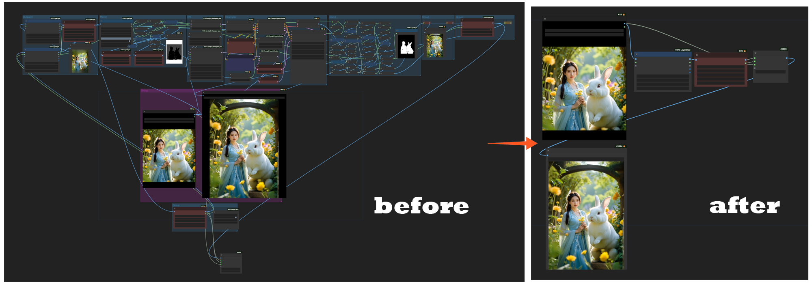

# ChenYu Node Encryption: ComfyUI Compression and Encryption Node

## Introduction
ChenYu Node Encryption is a compact ComfyUI open-source node designed to simplify workflows while providing encryption protection.

## Application Scenarios
- Workflow Simplification: Significantly reduces workflow complexity.
- Encryption Authorization: Protects core workflow concepts.

## Quick Start
You can view a simple [Workflow Demo](demo/original.json)

### Installation and Usage Steps
1. **Install Node**
   - Open ComfyUI\custom_Nodes\ directory and clone the repository locally
   - Or install ComfyUI Compression and Encryption Node through ComfyUI-Manager

2. **Startup and Configuration**
   - Start ComfyUI
   - Find ChenYu Node Encryption directory in the "Advanced" menu

3. **🔐 Usage**
   - Encryption components and encryption bridge mark the start and end of the encrypted workflow section
   - Random seeds are generated on the server to fix random number issues after workflow packaging

> ⚠️ Decryption components are automatically added - The system will automatically generate a workflow containing decryption components in the output folder after encryption
> 
> ⚠️ 10 serial numbers will be automatically generated during encryption, which will be bound to hardware information upon first use, and subsequent uses will verify the consistency of serial numbers with hardware information

## Contribution Guidelines
Welcome to contribute to the ChenYu Node Encryption project! You can submit Pull Requests or open Issues to suggest new features or report problems.

## License
This project is licensed under the MIT License. See the LICENSE file for details.

## Contact
Email：<hzxhzx321@gmail.com>

---
ChenYu Node Encryption © 2024. All Rights Reserved.